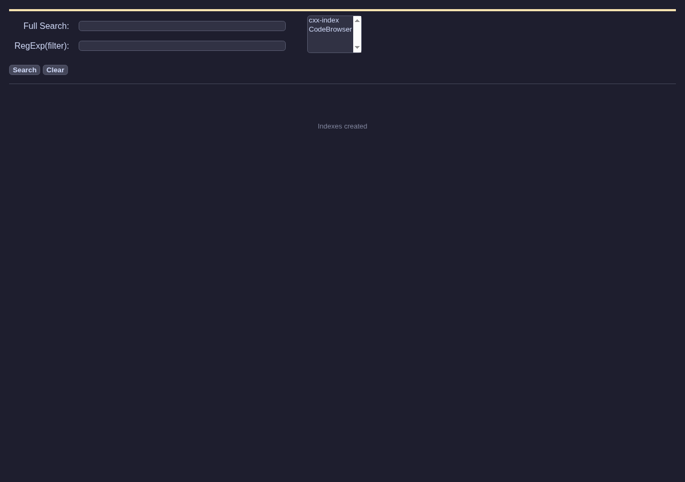
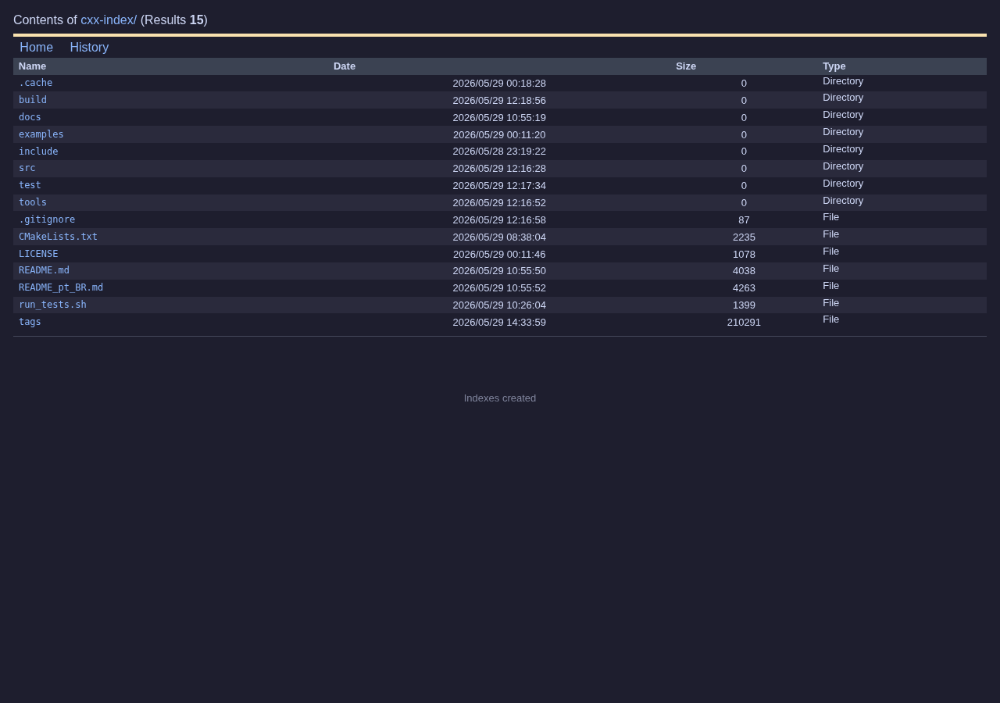
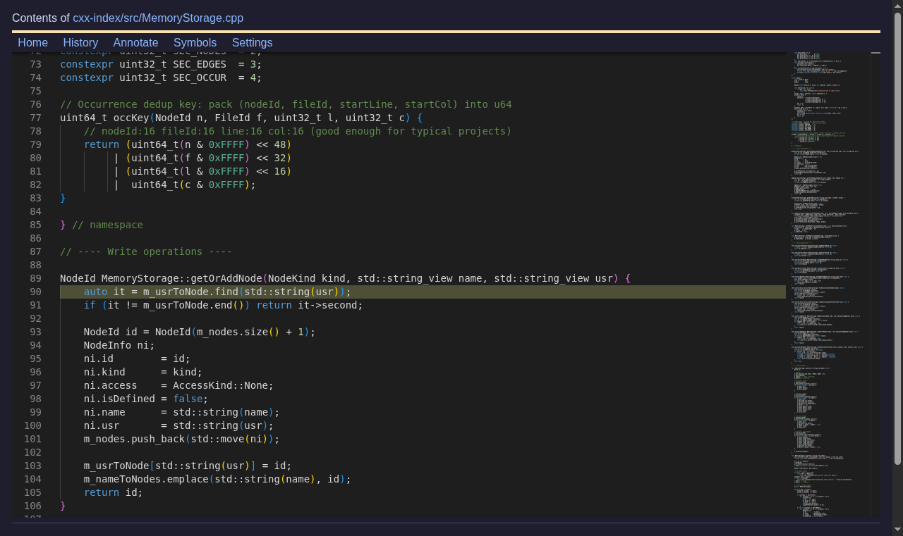
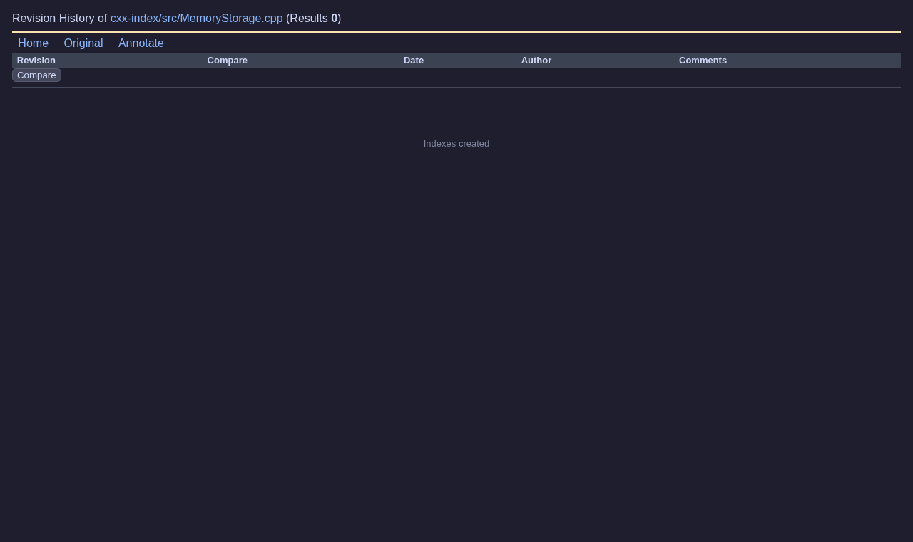
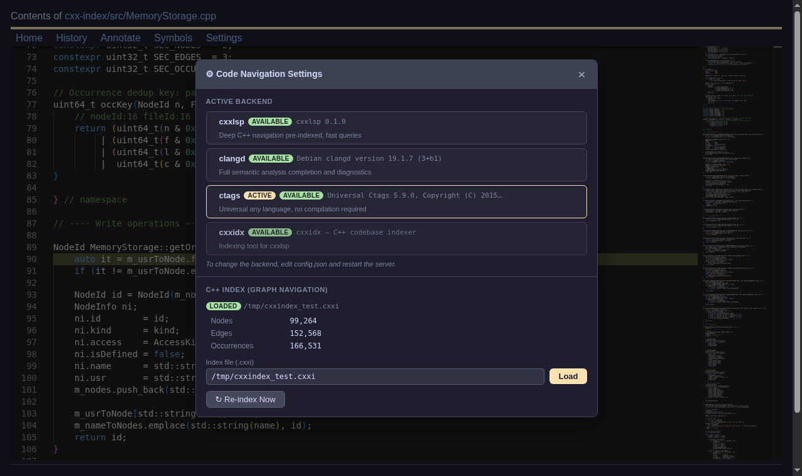
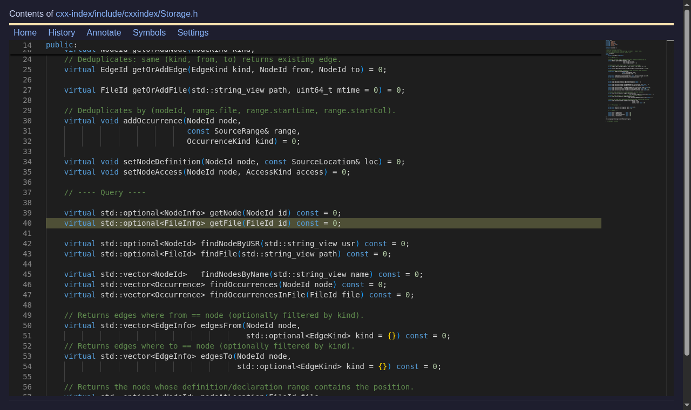

> [Versão em Português (pt-BR)](tutorial_pt_BR.md)

# CodeBrowser — User Tutorial

CodeBrowser is a web-based code navigation tool inspired by Sourcetrail and OpenGrok.
Browse your codebase from any browser or mobile device — no IDE required.

---

## Table of Contents

1. [Prerequisites](#1-prerequisites)
2. [Building](#2-building)
3. [Configuration](#3-configuration)
4. [Running](#4-running)
5. [Home / Search](#5-home--search)
6. [Folder View](#6-folder-view)
7. [Editor View](#7-editor-view)
8. [Symbol Panel](#8-symbol-panel)
9. [Code Navigation](#9-code-navigation)
10. [History & Blame](#10-history--blame)
11. [Settings — Backend Selector](#11-settings--backend-selector)
12. [C++ Graph Navigation (cxxlsp)](#12-c-graph-navigation-cxxlsp)

---

## 1. Prerequisites

| Tool | Purpose | Install |
|------|---------|---------|
| `g++` / `clang++` | Build CodeBrowser | `apt install g++` |
| `cmake >= 3.16` | Build system | `apt install cmake` |
| `git` | Revision history | `apt install git` |
| `ctags` | Symbol navigation (ctags backend) | `apt install universal-ctags` |
| `clangd` | C++ semantic analysis (optional) | `apt install clangd` |
| `cxxlsp` + `cxxidx` | Deep C++ graph navigation (optional) | Build from [cxx-index](../../cxx-index) |

---

## 2. Building

```bash
git clone https://github.com/gwerners/CodeBrowser
cd CodeBrowser
./run.bash noFullTextIndex   # build without Apache Lucy (recommended)
# or
./run.bash                   # build with full-text search (requires Clownfish/Lucy)
```

The script builds everything, then starts the server at `http://localhost:3000`.

To build without starting:

```bash
mkdir -p build && cd build
cmake .. -DUSE_LUCY=OFF
make -j$(nproc)
cd ..
```

---

## 3. Configuration

Edit `config.json` in the project root:

```json
{
    "symbol-provider": "ctags",
    "search-engine": "grep",
    "theme": "dark",
    "projects": [
        {
            "name": "myproject",
            "source": "/absolute/path/to/myproject",
            "index":  "index/myproject"
        }
    ]
}
```

### `symbol-provider` options

| Value | Requires | Features |
|-------|---------|----------|
| `"ctags"` | `ctags` binary | Definition, references, hover, symbols |
| `"clangd"` | `clangd` binary + `compile_commands.json` | Full semantic analysis |
| `"cxxlsp"` | `cxxlsp` binary + `index.cxxi` | Pre-indexed C++ with call/inheritance graphs |

### Full config example with cxxlsp

```json
{
    "symbol-provider": "cxxlsp",
    "lsp": "/path/to/cxxlsp",
    "cxxidx": "/path/to/cxxidx",
    "theme": "dark",
    "projects": [
        {
            "name": "myproject",
            "source": "/path/to/myproject",
            "index":  "index/myproject",
            "cxxindex": "/path/to/myproject/index.cxxi",
            "compilation-db": "/path/to/myproject/build/compile_commands.json"
        }
    ]
}
```

---

## 4. Running

```bash
./build/work/codebrowser           # uses config.json
./build/work/codebrowser my.json   # use a custom config file
```

Open `http://localhost:3000` in your browser.

---

## 5. Home / Search



The home page lets you search across all configured projects.

- **Full Search** — search for any string in file contents (grep or Apache Lucy)
- **RegExp (filter)** — filter results by file path using a regular expression
- **Project selector** — choose which projects to search; double-click a project name to browse its folder tree

---

## 6. Folder View



Browse the directory tree of a project. Click any directory to navigate into it, or click a file to open it in the editor. The **History** link shows the git commit history for the current folder.

---

## 7. Editor View



The editor uses Monaco (the same engine as VS Code) in read-only mode with syntax highlighting.

**Navbar links:**

| Link | Action |
|------|--------|
| Home | Return to the search page |
| History | Git commit history for this file |
| Annotate | Git blame — shows author and date per line |
| Symbols | Toggle the symbol outline panel |
| Settings | Open the backend settings modal |

**Keyboard shortcuts in the editor:**

| Shortcut | Action |
|----------|--------|
| `Ctrl+Click` | Go to definition |
| `Shift+Ctrl+Click` | Go to declaration |
| Right-click | Open context menu with all navigation actions |

---

## 8. Symbol Panel

Click **Symbols** in the navbar to open the symbol outline on the left side.

Symbols are grouped by kind (functions, classes, methods, fields…). Click any symbol to jump to its line in the editor. The panel is resizable by dragging its right edge.

---

## 9. Code Navigation

Right-click on any identifier in the editor to open the context menu:

| Action | Description |
|--------|-------------|
| Go to Definition | Jump to where the symbol is defined |
| Go to Declaration | Jump to the forward declaration |
| Go to Implementation | Jump to the implementing function/method |
| Go to Type Definition | Jump to the type definition |
| Show References | Popup overlay listing all usages with links |
| Switch Header/Source | Toggle between `.h` and `.cpp` files |
| Type Hierarchy | Navigate the type hierarchy |
| Search Word | Full-text search for the selected word |
| **Show Callers** | Graph of all functions that call this one *(cxxlsp only)* |
| **Show Callees** | Graph of all functions called by this one *(cxxlsp only)* |
| **Show Base Classes** | Inheritance graph upward *(cxxlsp only)* |
| **Show Derived Classes** | Inheritance graph downward *(cxxlsp only)* |
| **Show Members** | Members of a class/namespace *(cxxlsp only)* |

---

## 10. History & Blame

### File History

Click **History** from the editor to see all commits that modified the current file. Click a hash to view the file at that revision, or select two revisions with the radio buttons and click **Compare** for a side-by-side diff.

### Annotate (Git Blame)

Click **Annotate** from the editor to see git blame. Each line shows the commit hash, author, and date. Click a hash to navigate to that commit's version of the file.



---

## 11. Settings — Backend Selector

Click **Settings** in the editor navbar to open the settings modal.



**Backend section** shows all three backends with availability badges:

- `available` (green) — binary found on PATH or configured path
- `not found` (red) — binary not found
- `active` (gold) — currently active backend

> To change the active backend, edit `config.json` and restart the server.

**C++ Index (Graph Navigation) section** — always visible, independent of the active backend:

- Shows whether an index is loaded and its statistics (nodes, edges, occurrences)
- **Index file (.cxxi)** input — enter the path to an existing `.cxxi` file
- **Load** button — loads the index into memory immediately, **no server restart needed**
- **Re-index Now** button — triggers `cxxidx index` in the background once an index is loaded;
  a log stream appears showing progress

### Loading an existing index at runtime

You can use graph navigation (callers, callees, inheritance) on top of any active backend (ctags or clangd) by loading a pre-built index:

1. Build the index with `cxxidx` (see [section 12](#12-c-graph-navigation-cxxlsp))
2. Open **Settings**
3. Enter the `.cxxi` path in the **Index file** field
4. Click **Load**
5. The statistics appear immediately — right-click menu now shows graph actions

No `config.json` change or restart required.

---

## 12. C++ Graph Navigation (cxxlsp)

The graph panel appears on the right side of the editor when you select a graph action from the context menu.



### Setting up cxxlsp

**Step 1 — Build cxx-index:**

```bash
cd cxx-index
cmake -S . -B build -DLLVM_DIR=/usr/lib/llvm-19/lib/cmake/llvm \
                     -DClang_DIR=/usr/lib/llvm-19/lib/cmake/clang
cmake --build build --parallel
```

**Step 2 — Generate compile_commands.json for your project:**

```bash
cd /your/project
cmake -DCMAKE_EXPORT_COMPILE_COMMANDS=ON -B build
```

**Step 3 — Index your project:**

```bash
/path/to/cxx-index/build/cxxidx index build/compile_commands.json \
    -o /your/project/index.cxxi -v
```

**Step 4 — Configure CodeBrowser:**

```json
{
    "symbol-provider": "cxxlsp",
    "lsp": "/path/to/cxx-index/build/cxxlsp",
    "cxxidx": "/path/to/cxx-index/build/cxxidx",
    "projects": [{
        "name": "myproject",
        "source": "/your/project",
        "index":  "index/myproject",
        "cxxindex": "/your/project/index.cxxi"
    }]
}
```

### Using the graph panel

1. Right-click on a function name → **Show Callers** (or Callees, Members, etc.)
2. The graph panel opens on the right
3. Each node is coloured by symbol kind:
   - Blue — function
   - Green — method / constructor
   - Orange — class
   - Yellow — struct
   - Purple — enum
4. **Single-click** a node → shows full name and file location in the tooltip
5. **Double-click** a node → navigates the browser to that symbol's file and line
6. Drag the left edge of the graph panel to resize it
7. Click **×** in the graph header to close the panel

### Re-indexing after code changes

Either use the **Settings → Re-index Now** button, or run:

```bash
cxxidx index build/compile_commands.json -o index.cxxi
```

The server automatically picks up the new index on the next request.
